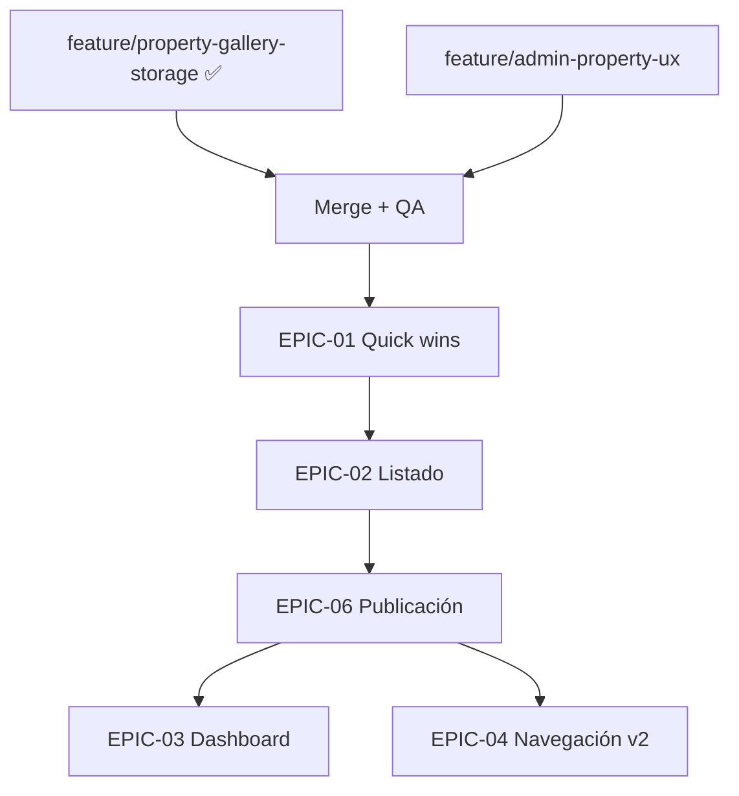

# Reality Check — Estado real vs documentación UX

Versión: 1.0  
Fecha: 2026-06-17  
Branch auditado en disco: `feature/admin-property-ux` @ `0aaf970`  
Branch con Storage verificado en git: `feature/property-gallery-storage` @ `9a0d8b9`

Estado: Validación — sin cambios de código.

---

## Resumen ejecutivo

Existe una **discrepancia real** entre lo probado en runtime y lo que contiene el branch actualmente checked out.

| Contexto | Storage + upload admin | Conclusión |
| -------- | ---------------------- | ---------- |
| **`feature/admin-property-ux` (disco)** | ❌ No existe | La auditoría original fue **correcta** para este branch |
| **`feature/property-gallery-storage` (git)** | ✅ Implementado y probado | Lo que el equipo validó en pruebas |
| **Árbol fusionado objetivo** | ✅ Tras merge de gallery → admin-property-ux | Base real para planificar UX |

**Causa raíz:** `feature/property-gallery-storage` está **2 commits adelante** de `feature/admin-property-ux`. Esos commits agregan ~1.818 líneas de Storage/R2/upload/reorder. No están mergeados en el branch UX.

```txt
feature/admin-property-ux     → 0aaf970 (fase B ficha técnica)
feature/property-gallery-storage → 9a0d8b9 (+ storage + CORS R2)
                                 ↑
                          2a38bea feat: implementa storage y galeria
                          9a0d8b9 fix: configura CORS Cloudflare R2
```

**Recomendación inmediata:** mergear `feature/property-gallery-storage` → `feature/admin-property-ux` **antes** de continuar implementación UX, y re-auditar disco post-merge.

---

## Metodología de verificación

| Método | Qué validó |
| ------ | ---------- |
| `Test-Path` / `Get-ChildItem` en disco | Archivos presentes en workspace |
| `git branch`, `git rev-parse`, `git log --not` | Relación entre branches |
| `git diff admin-property-ux gallery-storage --stat` | Delta exacto entre branches |
| `git show gallery-storage:path` | Contenido de Storage en branch probado |
| Lectura directa de controllers/services admin y API | Endpoints en HEAD actual |
| `grep` en `apps/` | Ausencia de upload-url en branch UX |

---

## 1. Funcionalidades que existen HOY

### 1.1 En `feature/admin-property-ux` (branch actual en disco)

#### API — módulos presentes

```txt
apps/api/src/modules/
├── auth                    ✅
├── property                ✅
├── property-listing        ✅
├── property-price          ✅
├── property-image          ✅ (CRUD metadata only)
├── property-feature        ✅
├── property-feature-assignment ✅
└── public-property         ✅

❌ storage/ — NO en disco
❌ admin-dashboard/ — NO existe
```

#### API — endpoints verificados (existentes)

| Método | Ruta | Estado |
| ------ | ---- | ------ |
| POST/GET/PATCH/DELETE | `/auth/*` | ✅ |
| CRUD | `/properties` | ✅ (`?isActive=` solo) |
| CRUD | `/property-listings` | ✅ |
| CRUD | `/property-prices` | ✅ |
| CRUD | `/property-images` | ✅ metadata |
| CRUD | `/property-features` | ✅ |
| PUT/GET/POST/DELETE | `/properties/:id/features` | ✅ |
| GET | `/public/properties`, `/featured`, `/:slug` | ✅ |

#### API — endpoints que la documentación UX asumió y NO están en este branch

| Método | Ruta | Estado en admin-property-ux |
| ------ | ---- | --------------------------- |
| POST | `/storage/upload-url` | ❌ |
| POST | `/property-images/upload-url` | ❌ |
| PATCH | `/property-images/reorder` | ❌ |
| GET | `/admin/dashboard/summary` | ❌ |
| GET | `/properties/:id/publishability` | ❌ |

#### Admin — pantallas y componentes verificados

| Área | Estado |
| ---- | ------ |
| Auth login + middleware + TenantSwitcher | ✅ |
| Dashboard `/` placeholder | ⏳ |
| CRUD `/propiedades/**` completo | ✅ |
| Tab Características | ✅ |
| Ficha técnica extendida (orientation, layout, brightness, yearBuilt…) | ✅ (commit `0aaf970`) |
| `PropertyPublishabilityPanel` (4 reglas hard) | ✅ |
| `PropertyImageManager` metadata manual | ✅ (sin upload) |
| `PropertyImageForm` pide `storageKey` manual | ✅ |
| Configuración placeholders | ⏳ |

#### Evidencia código — imágenes sin upload (branch UX)

`property-image-manager.tsx` línea 109:

```txt
"Ingresá la metadata de la imagen. El upload físico se implementará en una fase posterior."
```

`app.module.ts` — **no importa** `StorageModule`.

---

### 1.2 En `feature/property-gallery-storage` (branch probado — no mergeado)

Verificado vía `git show feature/property-gallery-storage:…`

#### API Storage — implementado

| Componente | Archivo | Estado |
| ---------- | ------- | ------ |
| StorageModule | `storage.module.ts` | ✅ |
| S3-compatible service (R2) | `s3-compatible-storage.service.ts` | ✅ |
| Storage config + env | `storage.config.ts`, `.env.example` | ✅ |
| Storage key util | `storage-key.util.ts` | ✅ |

#### Endpoints Storage — implementados

| Método | Ruta | Descripción |
| ------ | ---- | ----------- |
| POST | `/storage/upload-url` | Signed URL genérico por tenant |
| POST | `/property-images/upload-url` | Signed URL scoped a property |
| PATCH | `/property-images/reorder` | Batch reorder `{ items: [{ id, sortOrder }] }` |

#### Property Image — mejoras en gallery branch

| Capacidad | Estado |
| --------- | ------ |
| `createUploadUrl` en service | ✅ |
| `reorder` en service + repository | ✅ |
| Delete elimina archivo en storage | ✅ |
| DTO `CreatePropertyImageUploadUrlDto` | ✅ |
| DTO `ReorderPropertyImagesDto` | ✅ |
| `@aws-sdk/client-s3` en package.json | ✅ |

#### Admin — upload UI implementado

| Archivo | Estado |
| ------- | ------ |
| `property-image-uploader.tsx` | ✅ (186 líneas) |
| `lib/property/image-upload.ts` | ✅ (`putFileToSignedUrl`) |
| `property-image-manager.tsx` | ✅ usa uploader + `getPropertyImageUploadUrlAction` |
| `property-image-grid.tsx` | ✅ drag & drop reorder |
| `property-image-actions.ts` | ✅ `getPropertyImageUploadUrlAction`, `reorderPropertyImagesAction` |
| `property-image-form.tsx` | ✅ simplificado (sin storageKey manual en create) |

#### Infra R2

| Item | Estado |
| ---- | ------ |
| Variables `STORAGE_*` en `.env.example` | ✅ |
| Commit CORS R2 | ✅ `9a0d8b9` |

#### Lo que gallery-storage comparte con admin-property-ux

Características, publishability, ficha técnica, auth, CRUD completo — **ambos branches los tienen** (misma base `0aaf970`).

---

## 2. Funcionalidades de la auditoría que quedaron OBSOLETAS

Afirmaciones en docs generados que **ya no son válidas** si se toma como referencia el sistema probado (`gallery-storage`) o el árbol fusionado:

| # | Afirmación obsoleta (docs UX) | Realidad actual |
| - | ----------------------------- | --------------- |
| O1 | «No existe módulo storage en `apps/api`» | **Obsoleta** en gallery-storage; **vigente** solo en admin-property-ux sin merge |
| O2 | «Admin pide storageKey manual» | **Obsoleta** en gallery-storage; **vigente** en admin-property-ux |
| O3 | «`PropertyImageUploader` no existe» | **Obsoleta** — existe en gallery-storage |
| O4 | «No hay POST upload-url ni PATCH reorder» | **Obsoleta** en gallery-storage |
| O5 | «EPIC-05 hay que implementar desde cero» | **Obsoleta** — EPIC-05 está **hecha** en gallery-storage; falta **merge** |
| O6 | «Fase C Storage pendiente en código» | **Parcialmente obsoleta** — hecha en branch hermano |
| O7 | «MVP ~60% — O3 upload ❌» | **Obsoleta** tras merge — sube a ~73% |
| O8 | «Drag reorder imágenes pendiente» | **Obsoleta** en gallery-storage (HTML5 drag en grid) |

### Afirmaciones que siguen VIGENTES (en ambos branches)

| # | Afirmación | Verificado |
| - | ---------- | ---------- |
| V1 | Dashboard `/` es placeholder | ✅ |
| V2 | No hay endpoint KPIs / dashboard summary | ✅ |
| V3 | No hay `GET /properties/:id/publishability` | ✅ |
| V4 | Activación listing no exige imágenes/portada | ✅ `property-listing.service.ts` |
| V5 | Listado sin badges comerciales | ✅ `property-table.tsx` |
| V6 | Sin paginación/búsqueda en listado | ✅ |
| V7 | Publishability duplicada en admin TS (no API) | ✅ |
| V8 | RBAC solo en sidebar | ✅ |
| V9 | SUPER_ADMIN sin empty state dedicado | ✅ |
| V10 | Tab SEO no existe | ✅ |
| V11 | Navegación v2 (Resumen, Datos, Ubicación) no implementada | ✅ |
| V12 | PublicationGateModal no existe | ✅ |
| V13 | Slug inmutability post-publicación no enforced | ✅ |

---

## 3. Documentos que requieren corrección

| Documento | Severidad | Qué corregir |
| --------- | --------- | ------------ |
| `docs/audits/admin-property-ux-audit.md` | **Alta** | Nota storage: «en branch UX no; en gallery-storage sí». Eliminar nota que niega storage globalmente. |
| `docs/implementation/mvp-comercial-v1.md` | **Alta** | O3/O4 → ✅ tras merge; % MVP 60% → **73%** (árbol fusionado). |
| `docs/implementation/admin-property-ux-implementation-plan.md` | **Alta** | EPIC-05: de «implementar» a «mergear + validar + polish». |
| `docs/implementation/admin-property-ux-task-breakdown.md` | **Alta** | EPIC-05 tareas: marcar hechas en gallery-storage; agregar tareas merge. |
| `docs/implementation/admin-property-ux-priority-matrix.md` | **Media** | I27-I29 dejan de ser bloqueantes post-merge; bajar prioridad. |
| `docs/proposals/admin-property-ux-roadmap.md` | **Media** | Fase C Storage → ✅ en gallery-storage; pendiente merge. |
| `docs/proposals/property-module-v2.md` | **Media** | Sección imágenes I1: upload resuelto en gallery branch. |
| `docs/proposals/property-publication-checklist.md` | **Baja** | Sin cambios de reglas; upload ya no es blocker tras merge. |
| `docs/implementation/property-navigation-v2.md` | **Baja** | Wireframe imágenes con upload zone — alineado con gallery-storage. |
| `docs/proposals/dashboard-home-v1.md` | **Ninguna** | Sigue vigente íntegramente. |
| `docs/proposals/property-seo-tab.md` | **Ninguna** | Sigue vigente. |
| `PROJECT_STATE.md` | **Media** | Actualizar Fase C según branch activo; mencionar gallery-storage. |

**Este documento (`implementation-reality-check.md`)** es la fuente de corrección hasta que se actualicen los demás.

---

## 4. Porcentaje real del MVP comercial

### Metodología

13 requisitos obligatorios de `mvp-comercial-v1.md`:

* ✅ = 1.0  
* ⚠️ parcial = 0.5  
* ❌ = 0.0  

### Escenario A — `feature/admin-property-ux` solo (disco hoy)

| ID | Requisito | Puntaje |
| -- | --------- | ------- |
| O1 | Auth | 1.0 |
| O2 | CRUD ficha completa | 1.0 |
| O3 | Upload imágenes | 0.0 |
| O4 | Galería portada + orden | 0.5 (metadata + isCover API; sin upload/reorder UI) |
| O5 | Listings | 1.0 |
| O6 | Precios | 1.0 |
| O7 | Activación alineada web | 0.0 |
| O8 | Checklist accionable | 0.5 |
| O9 | Listado estado comercial | 0.0 |
| O10 | Ver en web | 0.5 |
| O11 | Web pública | 1.0 |
| O12 | Características | 1.0 |
| O13 | SUPER_ADMIN UX | 0.5 |

**Total: 8.0 / 13 = 61.5% ≈ 62%**

La auditoría original estimó ~60%. **Correcta** para este branch.

### Escenario B — Árbol fusionado (`admin-property-ux` + `property-gallery-storage`)

| ID | Cambio vs A | Puntaje |
| -- | ----------- | ------- |
| O3 | Upload R2 + uploader | **1.0** |
| O4 | Reorder drag + portada operativa | **1.0** |

**Total: 9.5 / 13 = 73.1% ≈ 73%**

### Escenario C — MVP comercial vendible (obligatorios + recomendables clave)

Con merge + R1 dashboard + R2 filtros + R3 tab resumen (aún no implementados):

Estimación post-merge sin más UX: **73%** obligatorio.  
Con recomendables R1-R3: **~85%** producto vendible.

### Gap restante hacia 100% obligatorio (post-merge)

| ID | Gap | Épica |
| -- | --- | ----- |
| O7 | Gate activación | EPIC-06 |
| O9 | Badges listado | EPIC-02 |
| O8 | Checklist con gate + progress | EPIC-06 |
| O10 | Ver en web consistente en listado | EPIC-02 |
| O13 | SUPER_ADMIN empty state | EPIC-01 |

**Esfuerzo restante obligatorio:** ~4-5 semanas (EPIC-01 + 02 + 06), no 6-8 como estimaba mvp-comercial-v1.md con storage incluido.

---

## 5. EPIC-05 (Storage & Gallery) — ¿Necesaria o completada?

### Veredicto

| Branch | Estado EPIC-05 |
| ------ | -------------- |
| `feature/admin-property-ux` | ❌ **No iniciada** (código ausente) |
| `feature/property-gallery-storage` | ✅ **Completada** (implementación core) |
| Plan UX global | 🔄 **Reclasificar** — no es épica de desarrollo; es **épica de integración** |

### Desglose EPIC-05 vs implementación gallery-storage

| Entregable planificado | gallery-storage | Pendiente post-merge |
| ---------------------- | --------------- | -------------------- |
| StorageModule API | ✅ | — |
| POST `/storage/upload-url` | ✅ | — |
| POST `/property-images/upload-url` | ✅ | — |
| PATCH `/property-images/reorder` | ✅ | — |
| S3CompatibleStorageService (R2) | ✅ | — |
| `PropertyImageUploader` admin | ✅ | — |
| `image-upload.ts` client | ✅ | — |
| Integración PropertyImageManager | ✅ | — |
| Drag reorder en grid | ✅ | — |
| Delete con cleanup storage | ✅ | — |
| CORS R2 | ✅ | — |
| Variables `.env.example` | ✅ | — |
| Cover hero destacada arriba | ❌ | Polish UX (opcional) |
| Tests E2E upload | ❓ no verificado | QA post-merge |
| `PROJECT_STATE.md` actualizado | ❌ | Documentación |
| Merge a branch UX | ❌ | **Bloqueante proceso** |

### Nueva definición EPIC-05 → «Integración Storage»

```txt
EPIC-05-INT (reemplaza EPIC-05 dev)
├── Merge feature/property-gallery-storage → feature/admin-property-ux
├── Resolver conflictos (image-form, image-manager, image-grid)
├── Smoke test: upload 1 imagen → cover auto → reorder → delete
├── Verificar STORAGE_* en .env local y Railway
├── Actualizar PROJECT_STATE + admin-modules.md
└── Cerrar Fase C en property-complete-mvp.md
```

**Duración estimada:** 0.5-1 semana (merge + QA), no 2-3 semanas de desarrollo.

---

## 6. Roadmap recalculado

### Estado por fase (considerando merge gallery-storage)

| Fase original | Estado real post-merge | Acción |
| ------------- | ---------------------- | ------ |
| **Fase 1** Quick wins | ⏳ Pendiente | Sin cambios — empezar aquí |
| **Fase 2** UX core (dashboard, listado) | ⏳ Pendiente | Prioridad sube — storage ya no compite |
| **Fase C** Storage + galería | ✅ **Hecha** en gallery-storage | Merge, no desarrollo |
| **Fase 3** Publicación checklist | ⏳ Pendiente | **Siguiente bloqueante comercial** |
| **Fase 4** SEO editable | ⏳ Pendiente | Sin cambios |

### Orden óptimo recalculado

```txt
0. MERGE gallery-storage → admin-property-ux     (0.5-1 sem)  ← NUEVO paso 0
1. Ola 0: EPIC-01 quick wins                     (1 sem)
2. Ola 1: EPIC-02 listado badges + filtros       (1-2 sem)
3. Ola 2: EPIC-06 publicación + gates            (2 sem)     ← sube prioridad
4. Ola 3: EPIC-03 dashboard + EPIC-04 navegación (2-3 sem)   ← paralelo
5. Ola 4: EPIC-07 SEO preview + EPIC-09 docs     (1-2 sem)
```

**Eliminado del camino crítico:** desarrollo Storage (EPIC-05 dev).  
**Añadido al camino crítico:** merge + smoke test.

### Diagrama actualizado



### Duración total recalculada

| Escenario | Semanas |
| --------- | ------- |
| Plan original (con EPIC-05 dev) | 10-14 |
| **Plan corregido (merge + UX)** | **8-11** |

Ahorro: ~2-3 semanas equivalentes a EPIC-05 ya implementada.

---

## 7. Matriz de confianza — qué creer en cada fuente

| Fuente | Confiabilidad para «estado real» | Notas |
| ------ | -------------------------------- | ----- |
| Disco en `feature/admin-property-ux` | ✅ Alta | Lo que compila/deploya este branch |
| Pruebas manuales del equipo | ✅ Alta | Probablemente en gallery-storage o env con ese código |
| `docs/audits/admin-property-ux-audit.md` | ⚠️ Media | Correcta para UX branch; incompleta para storage |
| Cursor glob index (storage paths) | ❌ Baja | Mostró archivos de gallery-storage no checkout |
| `PROJECT_STATE.md` | ⚠️ Media | Puede no reflejar gallery-storage merge |
| Este reality check | ✅ Alta | Cruza disco + git + branches |

---

## 8. Acciones recomendadas (sin implementar código)

### Inmediatas (proceso)

1. **Mergear** `feature/property-gallery-storage` en `feature/admin-property-ux` (o rebasar UX sobre gallery).
2. **Smoke test** post-merge: upload → list → reorder → set cover → delete.
3. **Actualizar** docs listados en §3 con referencia a este reality check.

### Planificación UX (siguiente sprint)

1. EPIC-01 quick wins (sin depender de storage).
2. EPIC-06 publicación gates — **ahora es el bloqueante #1** post-merge.
3. EPIC-02 listado con badges comerciales.
4. EPIC-03 dashboard.

### No replanificar

* Desarrollo StorageModule desde cero.
* `PropertyImageUploader` desde cero.
* Endpoints upload-url / reorder desde cero.

---

## 9. Checklist de verificación post-merge

Cuando se complete el merge, re-validar:

- [ ] `Test-Path apps/api/src/modules/storage/storage.module.ts` → True
- [ ] `apps/api/src/app.module.ts` importa `StorageModule`
- [ ] `property-image.controller.ts` tiene `upload-url` y `reorder`
- [ ] `property-image-uploader.tsx` existe en admin
- [ ] `property-image-manager.tsx` no menciona «fase posterior»
- [ ] Swagger `/api/docs` muestra tags Storage + upload-url
- [ ] Upload manual en `/propiedades/[id]/imagenes` funciona con R2 configurado

---

## 10. Conclusión

| Pregunta | Respuesta |
| -------- | --------- |
| ¿La auditoría UX mintió sobre storage? | **No** — describió correctamente `feature/admin-property-ux` en disco. |
| ¿El equipo tiene razón sobre upload funcionando? | **Sí** — en `feature/property-gallery-storage`, 2 commits adelante. |
| ¿EPIC-05 sigue siendo necesaria? | **Como desarrollo: no.** Como **merge + QA: sí**, ~1 semana. |
| ¿MVP comercial real? | **62%** (UX branch) → **73%** (tras merge gallery-storage). |
| ¿Próximo bloqueante comercial? | **EPIC-06** publicación gates + **EPIC-02** listado operativo. |

La documentación UX generada sigue siendo **válida en un 85-90%** para el trabajo pendiente. Las correcciones se concentran en **Storage (EPIC-05)**, **porcentaje MVP**, y **orden del roadmap** — no en rehacer el análisis de listado, dashboard, checklist o navegación v2.
