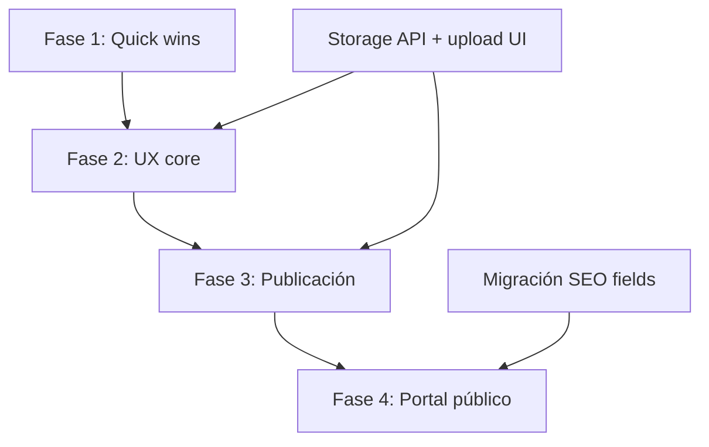

# Roadmap UX — Admin Property

Versión: 1.0  
Fecha: 2026-06-17  
Branch: `feature/admin-property-ux`  
Estado: Plan de implementación — sin código.

Referencias:

* `docs/audits/admin-property-ux-audit.md`
* `docs/proposals/dashboard-home-v1.md`
* `docs/proposals/property-module-v2.md`
* `docs/proposals/property-publication-checklist.md`
* `docs/proposals/property-seo-tab.md`
* `docs/04-modules/property-complete-mvp.md`

---

## Resumen

Roadmap en **4 fases** para transformar el módulo Propiedades de MVP funcional a producto comercializable, sin implementar contratos, consorcios ni CRM.

```txt
Fase 1 ──→ Fase 2 ──→ Fase 3 ──→ Fase 4
Quick wins   UX core    Publicación   Portal público
 (2-3 sem)   (3-4 sem)   (2-3 sem)     (3-4 sem)
```

---

## Fase 1 — Quick wins

**Objetivo:** mejoras visibles de bajo riesgo que no requieren migraciones ni endpoints nuevos (salvo excepciones menores).

### Entregables

| ID | Entregable | Descripción |
| -- | ---------- | ----------- |
| 1.1 | Badges comerciales en listado | `published` / `commercial-draft` / `archived` en `PropertyTable` |
| 1.2 | Filtro Activas / Archivadas | Tabs o toggle con `?isActive=` |
| 1.3 | Búsqueda client-side | Título, `internalCode`, ciudad |
| 1.4 | Acción «Ver en web» en listado | Link si publicable |
| 1.5 | Restaurar desde listado | Toggle archivar/restaurar |
| 1.6 | Renombrar «Archivar» listing → «Cerrar publicación» | Copy consistente |
| 1.7 | Warning slug en property publicada | Confirm modal en `PropertyForm` |
| 1.8 | Feature manager UX | Un Guardar sticky, feedback unificado |
| 1.9 | Loading skeletons | `loading.tsx` en rutas property principales |
| 1.10 | SUPER_ADMIN empty state | «Seleccioná una inmobiliaria» |
| 1.11 | TenantSwitcher visible en tablet | Quitar `hidden lg:block` restrictivo |
| 1.12 | Actualizar docs drift | `admin-modules.md`, `admin-nav.md` (Características, publicabilidad, auth) |

### Métricas

| Atributo | Valor |
| -------- | ----- |
| **Complejidad** | Baja |
| **Impacto** | Medio-Alto |
| **Dependencias** | Ninguna crítica; 1.1 ideal con publishability batch |
| **Prioridad** | P0 — empezar aquí |
| **Duración estimada** | 2-3 semanas (1 dev) |

### Riesgos

* Badge en listado sin endpoint batch → solución temporal: calcular client-side o limitar a < 50 properties.

---

## Fase 2 — Mejoras UX importantes

**Objetivo:** dashboard operativo, listado profesional, detalle reorganizado, tab SEO preview.

### Entregables

| ID | Entregable | Descripción |
| -- | ---------- | ----------- |
| 2.1 | Dashboard home v1 | KPIs + acciones rápidas + alerts (`dashboard-home-v1.md`) |
| 2.2 | `GET /admin/dashboard/summary` | Endpoint agregado KPIs + activity |
| 2.3 | Filtros API en listado | `q`, `propertyType`, `city`, `publishStatus` |
| 2.4 | Paginación server-side | Listado properties |
| 2.5 | Columna thumbnail + precio | List DTO enriquecido |
| 2.6 | `DataTable` compartida | Abstracción 3 tablas |
| 2.7 | Tab Resumen en detalle | Checklist + cards + next step |
| 2.8 | Split form: Datos / Ubicación | Tabs o rutas hijas |
| 2.9 | Header detalle enriquecido | Acciones globales, meta línea |
| 2.10 | Tab SEO preview-only | Warnings, sin migración (`property-seo-tab.md` 3a) |
| 2.11 | `ListingSubNav` | Precios dentro de contexto listing |
| 2.12 | Guards RBAC en rutas config | Redirect 403 |
| 2.13 | Upload imágenes en admin | Integrar Storage API (si disponible en merge) |
| 2.14 | `GET /properties?include=publishabilitySummary` | Batch para listado |

### Métricas

| Atributo | Valor |
| -------- | ----- |
| **Complejidad** | Media-Alta |
| **Impacto** | Alto |
| **Dependencias** | Fase 1 completa; Storage API para 2.13 |
| **Prioridad** | P0 |
| **Duración estimada** | 3-4 semanas |

### Paralelización posible

* 2.1-2.2 (dashboard) en paralelo con 2.7-2.8 (detalle)
* 2.10 (SEO preview) independiente
* 2.13 bloqueada hasta Storage en `apps/api`

---

## Fase 3 — Experiencia de publicación

**Objetivo:** checklist estilo Airbnb con bloqueos reales, progreso visible, activación alineada con Public API.

### Entregables

| ID | Entregable | Descripción |
| -- | ---------- | ----------- |
| 3.1 | Bloqueo activación sin imágenes/portada | `property-listing.service.ts` |
| 3.2 | `PublicationGateModal` | Pre-activación en listing form |
| 3.3 | `GET /properties/:id/publishability` | Fuente de verdad API |
| 3.4 | Shared publishability rules | Package compartido admin + API |
| 3.5 | Progress bar en checklist | % hard rules |
| 3.6 | Soft warnings (Fase D MVP) | Descripción, min fotos, ficha |
| 3.7 | Badge «Activa (no visible)» | Listing table |
| 3.8 | Empty states orientados a publicación | Imágenes, publicaciones, precios |
| 3.9 | Slug inmutability server-side | Si listing ACTIVE |
| 3.10 | Celebración + CTA «Ver en web» | Al completar checklist |
| 3.11 | Dashboard publish alerts | Blockers agregados |
| 3.12 | Reorder imágenes drag & drop | Si API reorder disponible |

### Métricas

| Atributo | Valor |
| -------- | ----- |
| **Complejidad** | Media |
| **Impacto** | Muy Alto |
| **Dependencias** | Fase 2 detalle (tab Resumen); imágenes upload (2.13) |
| **Prioridad** | P0 — diferenciador comercial |
| **Duración estimada** | 2-3 semanas |

### Criterio de cierre fase

> Ningún listing puede quedar ACTIVE sin cumplir las mismas reglas que Public API.

---

## Fase 4 — Preparación portal inmobiliario público

**Objetivo:** SEO editable, multi-operación pulida, datos admin ↔ web sincronizados, bases para escala.

### Entregables

| ID | Entregable | Descripción |
| -- | ---------- | ----------- |
| 4.1 | Migración campos SEO | `metaTitle`, `metaDescription`, `noIndex`, OG |
| 4.2 | Tab SEO editable | Form + persistencia |
| 4.3 | Web consume SEO overrides | `generateMetadata` + Public DTO |
| 4.4 | Sitemap respeta `noIndex` | `apps/web` |
| 4.5 | `AdminActivity` log (opcional) | Feed dashboard preciso |
| 4.6 | Duplicar propiedad | Productividad |
| 4.7 | Bulk actions listado | Archivar múltiples |
| 4.8 | Vista card mobile listado | Responsive |
| 4.9 | Canonical multi-listing strategy | Documentar + implementar |
| 4.10 | OG image selector | Elegir imagen distinta a portada |
| 4.11 | Integración leads (preview) | CTA «Consultar» desde admin preview |
| 4.12 | Performance listado | Virtualización si > 200 items |

### Métricas

| Atributo | Valor |
| -------- | ----- |
| **Complejidad** | Alta |
| **Impacto** | Alto (largo plazo) |
| **Dependencias** | Fase 3 cerrada; coordinación con `apps/web` |
| **Prioridad** | P1 |
| **Duración estimada** | 3-4 semanas |

### Nota migraciones

Fase 4.1 requiere ciclo completo: Prisma → migración → docs `property-domain.md` → API → admin → web.

---

## Matriz consolidada

| Fase | Complejidad | Impacto | Dependencias | Prioridad |
| ---- | ----------- | ------- | ------------ | --------- |
| **1** Quick wins | Baja | Medio-Alto | — | P0 |
| **2** UX core | Media-Alta | Alto | Fase 1; Storage para upload | P0 |
| **3** Publicación | Media | Muy Alto | Fase 2 detalle + imágenes | P0 |
| **4** Portal público | Alta | Alto | Fase 3; migración SEO | P1 |

---

## Diagrama de dependencias



---

## Orden de implementación recomendado (sprints)

### Sprint 1-2 (Fase 1)

1. Docs drift + empty states + loading
2. Listado: badges, filtros, búsqueda, ver web, restaurar
3. Copy fixes (cerrar publicación, slug warning)

### Sprint 3-4 (Fase 2a)

1. Endpoint dashboard summary + dashboard home
2. Endpoint publishability batch
3. Listado: paginación, thumbnails, DataTable

### Sprint 5-6 (Fase 2b)

1. Tab Resumen + split form
2. SEO preview tab
3. Upload imágenes (si Storage mergeado)
4. ListingSubNav

### Sprint 7-8 (Fase 3)

1. Backend bloqueo activación
2. PublicationGateModal + shared rules
3. Progress bar + soft warnings
4. Slug inmutability

### Sprint 9+ (Fase 4)

1. Migración SEO
2. Tab SEO editable + web sync
3. Activity log, bulk actions, mobile cards

---

## Fuera de alcance (explícito)

| Tema | Fase futura |
| ---- | ----------- |
| Contratos / consorcios | No incluido |
| CRM / Leads admin | Lead Domain |
| RBAC API `@Roles` | Auth v1.1 |
| Emprendimientos | Development Domain |
| Configuración usuarios/inmobiliaria | Post-UX property |
| Buscador avanzado web | Property MVP Fase E |

---

## Definición de éxito global

Al cerrar Fase 3, una inmobiliaria demo puede:

1. Entrar al dashboard y ver su inventario en números reales.
2. Encontrar cualquier propiedad en < 10 segundos.
3. Completar el flujo crear → fotos → publicar sin ingresar `storageKey` manual.
4. Ver progreso de publicación estilo Airbnb con bloqueos claros.
5. Activar una publicación solo cuando sea visible en web.
6. Abrir «Ver en web» con confianza de que el listing existe públicamente.

Al cerrar Fase 4, además:

7. Controlar SEO por propiedad desde admin.
8. Excluir propiedades del índice de buscadores.
9. Operar listados grandes con paginación y bulk actions.

---

## Documentos del paquete de análisis

| Documento | Rol en roadmap |
| --------- | -------------- |
| `admin-property-ux-audit.md` | Línea base — estado actual |
| `dashboard-home-v1.md` | Fase 2.1-2.2 |
| `property-module-v2.md` | Fase 1-2 listado y detalle |
| `property-publication-checklist.md` | Fase 3 completa |
| `property-seo-tab.md` | Fase 2.10 + Fase 4 |
| `admin-property-ux-roadmap.md` | Este documento — plan maestro |
